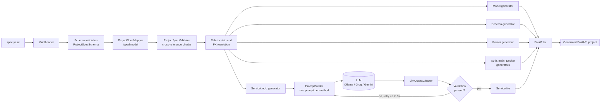

<div align="center">

# ⚙️ Codegen

### Describe your API in YAML. Get a runnable FastAPI backend in minutes.

A spec-driven backend generator that turns a single YAML file into a complete, Dockerised
**FastAPI + SQLAlchemy + PostgreSQL + JWT** service. Deterministic templates build the structure,
and a local or hosted LLM writes only the business logic, under guardrails.


[Quick start](#-quick-start) ·
[How it works](#-how-it-works) ·
[YAML spec](#-yaml-specification) ·
[What it can build](#-what-it-can-build) ·
[Roadmap](#-roadmap)

</div>

---

## Table of contents

- [Why Codegen](#-why-codegen)
- [Features](#-features)
- [How it works](#-how-it-works)
- [Quick start](#-quick-start)
- [CLI reference](#-cli-reference)
- [YAML specification](#-yaml-specification)
- [Generated project](#-generated-project)
- [Generated API conventions](#-generated-api-conventions)
- [What it can build](#-what-it-can-build)
- [Testing and quality](#-testing-and-quality)
- [Known limitations](#-known-limitations)
- [Roadmap](#-roadmap)
- [Troubleshooting](#-troubleshooting)
- [Contributing](#-contributing)
- [License](#-license)

---

## 💡 Why Codegen

Most backend services start the same way: users, an owner column, CRUD endpoints, JWT auth,
a Dockerfile, a database. Writing it by hand is slow. Asking an LLM to write the whole project
is fast but unreliable, because the output drifts, names disagree between files, and the app
often fails to start.

Codegen splits the problem in two:

| Part | Who writes it | Why |
|---|---|---|
| Structure: models, schemas, routers, auth, `main.py`, Docker, requirements | **Deterministic templates** (FreeMarker) | Must be identical, consistent and always importable |
| Business logic: the body of each service method | **LLM**, driven by the `intent` text in your YAML | Needs judgement and is different for every project |

The LLM never decides file names, imports, routes or field names. It receives the exact entity,
column and foreign-key facts from your spec and fills in one method body at a time. Each body is
checked before it is accepted, and rejected output is retried.

---

## ✨ Features

- **One YAML in, one project out.** Entities, relationships, routers, endpoints and service intents in a single file.
- **Complete runnable output.** FastAPI app, SQLAlchemy models, Pydantic schemas, routers, services, JWT auth, `Dockerfile`, `docker-compose.yml`, `requirements.txt`.
- **Relationship-aware.** Foreign keys are resolved from your relationships by convention. Ownership scoping is derived from the spec, not guessed.
- **Server-controlled fields.** Mark a field `readOnly: true` and clients can never set it (see [readOnly](#readonly-fields)).
- **Pluggable LLM backends.** Run fully local with **Ollama**, or use **Groq** or **Gemini**.
- **Guardrailed generation.** Per-method prompts, output cleaning, validation and up to three attempts.
- **Spec validation up front.** Invalid or contradictory specs fail before any code is written.
- **Verified end to end.** Generated APIs are exercised by black-box test scripts in Docker.

---

## 🧭 How it works



### Pipeline stages

1. **Load and validate.** `YamlLoader` reads the file and `ProjectSpecSchema` checks its shape. Types, required keys and allowed values are enforced here.
2. **Map to a typed model.** `ProjectSpecMapper` converts the YAML into Java specs (`EntitySpec`, `FieldSpec`, `RouterSpec`, `ServiceLogicSpec`, ...).
3. **Cross-check.** `ProjectSpecValidator` verifies references: relationship targets exist, handlers map to services, foreign keys can be resolved.
4. **Resolve relationships.** Each `many_to_one` relationship is bound to a concrete foreign-key column, and each entity's "scoped to the current user" column is identified.
5. **Generate structure from templates.** Models, schemas, routers, auth, `main.py`, Docker files and requirements are rendered from FreeMarker templates.
6. **Generate service logic with the LLM.** For every service method, `PromptBuilder` assembles a focused prompt (the intent, the entities it touches, exact column names, ownership rules and coding constraints). The reply is cleaned, checked and retried on failure.
7. **Write the project.** `FileWriter` writes the final tree to the output directory.

### Source layout

| Package | Responsibility |
|---|---|
| `cli` | Command-line entry (`generate`) |
| `yaml`, `schema`, `mapper`, `model`, `validation` | Loading, validating and modelling the spec |
| `generator` | Template-driven generators (models, schemas, routers, main, auth, Docker, service logic) |
| `architect`, `llm` | LLM clients (Ollama, Groq, Gemini), prompt building and output cleaning |
| `orchestrator` | `ProjectGenerator` coordinates the pipeline, `FileWriter` writes the result |
| `util`, `configs`, `animations` | Naming, text cleaning, registry, configuration, terminal feedback |
| `resources/templates` | FreeMarker templates for all generated Python and Docker files |

---

## 🚀 Quick start

### Prerequisites

| Requirement | Notes |
|---|---|
| **JDK** | Required to build and run the generator (use the version in the build file) |
| **Ollama** | For local generation. Install it and pull a model, for example `ollama pull qwen2.5-coder:7b-instruct` |
| **Docker + Docker Compose** | To run the generated project |
| **Groq or Gemini API key** | Only if you choose those providers instead of Ollama |

### 1. Get the code

```bash
git clone https://github.com/prash-spartanx/codegen.git
cd codegen
```

### 2. Write a spec

Use the example in [YAML specification](#-yaml-specification), or start from `src/main/resources/temp.yaml`.

### 3. Generate a project

**Option A: from a terminal** in the directory that contains the built project:

```bat
generate -y "C:\Users\prashant\OneDrive\Desktop\codegen\src\main\resources\temp.yaml" -p ollama -m qwen2.5-coder:7b-instruct -o ./temp-api
```

**Option B: from your IDE.** Run `CodegenApplication` and put the same arguments in the run
configuration's *Program arguments*, **without** the leading `generate` word:

```text
-y "C:\Users\prashant\OneDrive\Desktop\codegen\src\main\resources\temp.yaml" -p ollama -m qwen2.5-coder:7b-instruct -o ./temp-api
```

You will see each service being generated, with progress for every prompt and attempt.

### 4. Run the generated API

```bash
cd temp-api

# Windows (cmd):   set JWT_SECRET=change-me-to-a-long-random-string
# PowerShell:      $env:JWT_SECRET="change-me-to-a-long-random-string"
# macOS / Linux:   export JWT_SECRET=change-me-to-a-long-random-string

docker compose up --build
```

Open **http://localhost:8000/docs** for the interactive Swagger UI.

> **Tip:** if you regenerate and re-run, use `docker compose down -v` first so old tables
> and users from a previous run do not interfere.

---

## 🖥 CLI reference

| Flag | Meaning | Example |
|---|---|---|
| `-y` | Path to the YAML spec | `-y "C:\specs\shop-api.yaml"` |
| `-p` | LLM provider: `ollama`, `groq` or `gemini` | `-p ollama` |
| `-m` | Model name for that provider | `-m qwen2.5-coder:7b-instruct` |
| `-o` | Output directory for the generated project | `-o ./shop-api` |

The first positional word `generate` is required on the command line and must be left out when you
pass arguments through an IDE run configuration.

<details>
<summary><strong>Choosing a model</strong></summary>

- **Local (Ollama):** free, private and works offline. A code-tuned 7B model such as `qwen2.5-coder:7b-instruct` handles the standard cases, but small models occasionally skip an intent clause. Codegen retries and validates, and a larger model reduces retries.
- **Hosted (Groq / Gemini):** faster, and generally more faithful to long intents. Requires an API key and sends your entity and intent text to the provider.

</details>

---

## 📐 YAML specification

### Top-level keys

| Key | Required | Description |
|---|---|---|
| `name` | yes | Project name. Used for the app title, container names and database name |
| `description` | yes | Shown in the API docs |
| `pythonVersion` | yes | Python version for the generated Dockerfile, for example `"3.12"` |
| `services` | yes | List of logical service names |
| `entities` | yes | Data model: fields and relationships |
| `routers` | yes | HTTP routers and their endpoints |
| `serviceLogics` | yes | One entry per handler with its `intent` |
| `jwtAuth` | yes | JWT settings |
| `rateLimiter` | **set to `null`** | Not implemented yet, see [Roadmap](#-roadmap) |
| `kafka` | **set to `null`** | Not implemented yet |
| `urlShortener` | **set to `null`** | Not implemented yet |
| `apiGateway` | **set to `null`** | Not implemented yet |

### Entities and fields

```yaml
entities:
  - name: Order
    fields:
      - name: id
        type: int
        primaryKey: true
        nullable: false
        unique: true
        defaultValue: null
      - name: total_price
        type: float
        primaryKey: false
        nullable: false
        unique: false
        defaultValue: 0.0
        readOnly: true
    relationships:
      - type: many_to_one
        target: User
        field: customer
```

| Field property | Type | Description |
|---|---|---|
| `name` | string | Column name |
| `type` | `int` \| `str` \| `float` \| `bool` | Mapped to `Integer`, `String`, `Float`, `Boolean` |
| `primaryKey` | boolean | Marks the primary key |
| `nullable` | boolean | Whether the column accepts `NULL` |
| `unique` | boolean | Adds a unique constraint |
| `defaultValue` | string, number, boolean or `null` | Column default. Written as a native YAML value, for example `true`, `3`, `0.0`, `"member"` |
| `readOnly` | boolean, default `false` | Server-controlled field. See below |

#### `readOnly` fields

Some values must never be chosen by the client: an order's `status`, a computed `total_price`, a
user's `role`. Mark them `readOnly: true`:

```yaml
- name: status
  type: str
  primaryKey: false
  nullable: false
  unique: false
  defaultValue: "placed"
  readOnly: true
```

For a `readOnly` field Codegen:

- keeps it in the **response** schema, so clients can read it,
- removes it from the **create and update** schemas, so a client value is ignored,
- tells the LLM to use the default or the value the intent implies, never the request,
- leaves it out of the register flow for the auth entity (for example `role` becomes `"member"`).

#### Relationships

| Type | Meaning |
|---|---|
| `many_to_one` | This entity holds the foreign key (`Task.project`) |
| `one_to_many` | The other entity holds the foreign key (`Project.tasks`) |

Foreign keys are found by convention, so you do not declare them twice. For a `many_to_one`
relationship named `owner` pointing at `User`, Codegen looks for, in order: `owner_id`, then
`user_id`, then a single remaining unclaimed `int` column. If none matches, generation stops
with an error instead of writing a broken model.

The foreign key that points at the authenticated user and has no default is treated as the
**ownership column**. It is set from the token, never from the request body, and it is removed
from the create and update schemas automatically.

### Routers and endpoints

```yaml
routers:
  - name: orders
    prefix: /orders
    authRequired: true        # false makes the whole router public
    dependsOn: [auth]
    endpoints:
      - method: POST          # GET, POST, PUT, PATCH, DELETE
        path: /{order_id}/cancel
        handler: cancel_order # must match a serviceLogics entry
        requestBody: null     # a schema name or null
        responseBody: OrderResponse
```

Generated schemas follow a naming pattern: `<Entity>Create`, `<Entity>Update`,
`<Entity>Response` and `<Entity>ListResponse`, plus `UserLogin` and `TokenResponse` for auth.

### Service logic and intents

```yaml
serviceLogics:
  - name: cancel_order
    dependsOn: [place_order]
    methods:
      - name: cancel_order
        params:
          - name: order_id
            type: int
          - name: current_user
            type: User
        returns: Order
        intent: >
          Cancel an order placed by the current user, set its status to cancelled
          and add the order quantity back to the product stock. Reject if it is
          already cancelled.
```

The **`intent`** is the instruction the LLM implements. Write it like a short acceptance
criterion.

<details>
<summary><strong>Writing good intents</strong></summary>

- State each rule as its own clause: *"must exist and be active, quantity must be at least 1 and not exceed stock"*.
- Name the fields and effects: *"decrease the product stock by the quantity"*.
- Say who owns what: *"placed by the current user"*, *"reported by or assigned to the current user"*.
- State rejections explicitly: *"Reject if already cancelled"*. Rejections that are not in the intent should not appear in the code.
- Keep one responsibility per method. Short, specific intents produce the most reliable code.

</details>

### Authentication

```yaml
jwtAuth:
  secretEnv: JWT_SECRET
  algorithm: HS256
  accessTokenExpirationMinutes: 30
  refreshTokenExpirationDays: 7
```

The secret is read from the environment variable named in `secretEnv`. The generated
`docker-compose.yml` forwards it into the container.

### Complete minimal example

<details>
<summary><strong>notes-api.yaml</strong></summary>

```yaml
name: notes-api
description: A tiny notes API.
pythonVersion: "3.12"
services:
  - notes

entities:
  - name: User
    fields:
      - {name: id, type: int, primaryKey: true, nullable: false, unique: true, defaultValue: null}
      - {name: name, type: str, primaryKey: false, nullable: false, unique: false, defaultValue: null}
      - {name: email, type: str, primaryKey: false, nullable: false, unique: true, defaultValue: null}
      - {name: password, type: str, primaryKey: false, nullable: false, unique: false, defaultValue: null}
    relationships:
      - {type: one_to_many, target: Note, field: notes}

  - name: Note
    fields:
      - {name: id, type: int, primaryKey: true, nullable: false, unique: true, defaultValue: null}
      - {name: text, type: str, primaryKey: false, nullable: false, unique: false, defaultValue: null}
      - {name: pinned, type: bool, primaryKey: false, nullable: false, unique: false, defaultValue: false}
      - {name: owner_id, type: int, primaryKey: false, nullable: false, unique: false, defaultValue: null}
    relationships:
      - {type: many_to_one, target: User, field: owner}

routers:
  - name: auth
    prefix: /auth
    authRequired: false
    dependsOn: []
    endpoints:
      - {method: POST, path: /register, handler: register_user, requestBody: UserCreate, responseBody: UserResponse}
      - {method: POST, path: /login, handler: login_user, requestBody: UserLogin, responseBody: TokenResponse}
  - name: notes
    prefix: /notes
    authRequired: true
    dependsOn: [auth]
    endpoints:
      - {method: POST, path: /, handler: create_note, requestBody: NoteCreate, responseBody: NoteResponse}
      - {method: GET, path: /, handler: list_notes, requestBody: null, responseBody: NoteListResponse}

serviceLogics:
  - name: create_note
    dependsOn: []
    methods:
      - name: create_note
        params:
          - {name: note_data, type: NoteCreate}
          - {name: current_user, type: User}
        returns: Note
        intent: Create a note owned by the current authenticated user.
  - name: list_notes
    dependsOn: [create_note]
    methods:
      - name: list_notes
        params:
          - {name: current_user, type: User}
        returns: list[Note]
        intent: Return all notes owned by the current authenticated user.

jwtAuth:
  secretEnv: JWT_SECRET
  algorithm: HS256
  accessTokenExpirationMinutes: 30
  refreshTokenExpirationDays: 7

rateLimiter: null
kafka: null
urlShortener: null
apiGateway: null
```

</details>

---

## 📦 Generated project

```text
your-api/
├── Dockerfile
├── docker-compose.yml          # app + PostgreSQL 16
├── requirements.txt
└── app/
    ├── main.py                 # FastAPI app, routers, table creation
    ├── database.py             # engine, session, Base
    ├── auth.py                 # JWT creation and get_current_user
    ├── models/                 # SQLAlchemy models, one per entity
    ├── schemas/                # Pydantic request and response schemas
    ├── routers/                # one router per spec router
    └── services/               # one class per handler (LLM-written logic)
```

**Stack:** FastAPI · SQLAlchemy · Pydantic · python-jose (JWT) · passlib/bcrypt · PostgreSQL · Docker Compose

---

## 🔌 Generated API conventions

Every generated API follows the same behaviour, so clients can rely on it.

| Topic | Behaviour |
|---|---|
| **Auth** | `POST /auth/register`, `POST /auth/login`, bearer-token JWT. Missing or invalid tokens return `401` |
| **Passwords** | Hashed with bcrypt and never returned in any response |
| **Ownership** | The owner column is set from the token. A client-supplied owner is ignored |
| **Not yours = not found** | Records belonging to someone else return `404`, so ids cannot be probed |
| **List responses** | `{ "items": [...], "total": N }` |
| **Deletes** | `204 No Content` |
| **Child data** | Deleting a parent removes dependent children, except where the child's foreign key is nullable. There it is cleared and the child is kept |
| **Validation** | Pydantic errors return `422`. Business-rule rejections return `400` |
| **Public routes** | A router with `authRequired: false` needs no token |
| **Server-controlled fields** | `readOnly` fields are returned but cannot be set |

---

## 🧩 What it can build

Codegen fits **CRUD-centred, owner-scoped, relational REST backends**: systems of users plus a
few related entities with simple rules and state changes.

| Domain | Typical entities | Exercised features |
|---|---|---|
| Task and project managers | Project, Task | Parent ownership, assignment, partial updates |
| Blogs | Post, Comment | Visibility rules, publish toggles, bool defaults |
| Expense trackers | Category, Expense | Float amounts, custom owner column names |
| Library or lending | Branch, Book, Loan | Stock counts, borrow and return flows, cascades |
| Shops | Product, Address, Order | Public catalog, readOnly totals, computed values, optional foreign keys |
| Issue trackers | Ticket | Two foreign keys to the same table, reporter and assignee roles |

**Good fit:** internal tools, MVP backends, prototypes, teaching projects, and starting points you
will extend by hand.

**Not a fit (yet):** event streaming, multi-tenant platforms, complex reporting, workflows that
span many services, or anything that needs rate limiting, Kafka, a gateway or URL shortening.

---

## ✅ Testing and quality

Generated services are tested as black boxes: each project is built into Docker and driven by an
end-to-end Python script that registers several users and tries both the happy path and the
attacks.

Typical checks include:

- auth required, bad tokens, duplicate email, wrong password
- one user cannot read, edit, delete, return or cancel another user's records
- ownership and `readOnly` fields cannot be spoofed in request bodies
- business rules: stock limits, state transitions, double-return and double-cancel rejection
- side effects: stock decrements and restores, computed totals
- cascades, optional foreign keys and public routes

Representative results from the latest runs:

| Project | Result |
|---|---|
| Task manager, blog, expense tracker, library | All end-to-end checks pass |
| Shop (public catalog, readOnly, optional FK, cascade rules) | **55 / 55** checks pass |
| Ticket tracker (two FKs to one table) | Starts and passes 50 of 56 checks. The remaining failures are in `close_ticket` (see below) |

Because part of the output is LLM-written, **always run the generated project's tests before using
it in production**.

---

## ⚠️ Known limitations

- **LLM variance.** Service bodies can differ between runs and models. Smaller local models are more likely to drop a clause of a long intent. Validation and retries catch most of this, not all.
- **Ticket tracker `close_ticket`.** For a ticket assigned to another user, the generated lookup can match only the reporter, so assignees cannot close it, and a second close by the reporter is not rejected. Phrase the intent with both roles explicitly and re-check this method after generation.
- **Not implemented:** `rateLimiter`, `kafka`, `urlShortener` and `apiGateway` must be `null`.
- **Types:** `int`, `str`, `float` and `bool` are supported. Dates, enums, decimals and JSON columns are not tested.
- **Relationships:** `one_to_many` and `many_to_one` only. There is no `many_to_many` or self-reference support yet.
- **Several foreign keys to one table:** supported on the owning side. A back-reference list on the target (for example `User.reported_tickets`) cannot say which key it uses, so leave it out of the spec.
- **Auth:** email and password login and a single access token. Refresh tokens, roles and permissions are not generated.
- **Migrations:** tables are created at startup. There is no Alembic setup yet.
- **Concurrency:** counters such as stock are updated without row locks, so simultaneous requests for the last unit can both succeed.

---

## 🗺 Roadmap

**v2 (planned)**

- [ ] Package Codegen itself as a **Docker image**, so you run it with no JDK and no local build
- [ ] Rate limiter (in-memory and Redis)
- [ ] Kafka producers and consumers
- [ ] URL shortener module
- [ ] API gateway
- [ ] Spec-level `cascade` option per relationship
- [ ] Deterministic generation of standard get, update and delete services, using the LLM only for custom logic
- [ ] Automatic post-generation checks: import test, mapper configuration, scripted smoke test
- [ ] Row locking for stock and balance style updates
- [ ] Alembic migrations, refresh tokens and roles
- [ ] More column types (dates, enums, decimals)

---

## 🛠 Troubleshooting

| Symptom | Likely cause and fix |
|---|---|
| Generation fails with a spec error | Check the YAML against [YAML specification](#-yaml-specification). All four unsupported blocks must be `null` |
| `defaultValue` rejected | Use native YAML values: `true`, `3`, `0.0`, `"text"`, or `null` |
| `Could not find FK field` or a relationship error | Name the foreign-key column after the relationship (`owner` → `owner_id`) or its target (`user_id`) |
| Ollama connection refused | Make sure Ollama is running and the model is pulled |
| Generated app returns `500` on one endpoint | Run `docker logs <project>_app` and read the last traceback, then adjust the intent and regenerate |
| `JWT_SECRET` errors at startup | Export `JWT_SECRET` before `docker compose up` |
| Old users or tables show up | Run `docker compose down -v` to reset the database volume |
| Port already in use | Stop the previous stack or change the host port in `docker-compose.yml` |

---

## 🤝 Contributing

Contributions are welcome.

1. Fork the repository and create a branch.
2. Add or change a template, generator or validator.
3. Generate at least two different example specs and run their end-to-end scripts.
4. Open a pull request describing what changed and which specs you tested.

Bug reports are most useful with the YAML spec, the model and provider used, the generated
file that is wrong, and the container log.

---

## 📄 License

Add your license here (for example MIT) and include a `LICENSE` file in the repository.

---

<div align="center">

Built with ☕ and a lot of end-to-end testing.

**[⬆ back to top](#️-codegen)**

</div>
